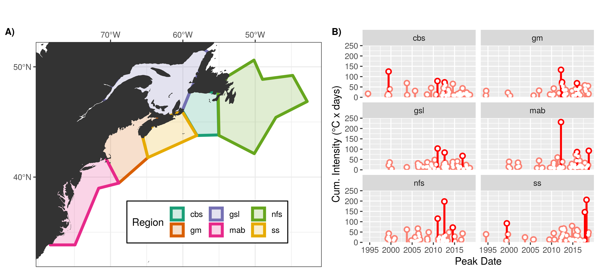

---
# Remember that this needs to be opened in Chrome to be viewed correctly and when creating the PDF
# OSM poster guidelines: https://www.agu.org/Ocean-Sciences-Meeting/Pages/Presenter-Guidelines#1
# Maximum Poster Dimensions: 45” x 45” (3.75 feet by 3.75 feet). 
# Each presenter will share an 8’W x 4’H poster board.
# Poster#: PC44C-1898
poster_height: "30in" # A1 23.39
poster_width: "45in" # A1 33.11
font_family: 'Rasa'
#ESSENTIALS
title: '**Primary Drivers of Marine Heatwaves in the Northwest Atlantic**'
author:
  - name: '**Robert W. Schlegel**'
    affil: 1,2,*
    main: true
    orcid: '0000-0002-0705-1287'
    twitter: robwschlegel 
    email: robert.schlegel@dal.ca
  - name: Ke Chen
    affil: 2
  - name: Eric C. J. Oliver
    affil: 1
affiliation:
  - num: 1
    address: Department of Oceanography, Dalhousie University, Halifax, Nova Scotia, Canada
  - num: 2
    address: Physical Oceanography Department, Woods Hole Oceanographic Institution, Woods Hole, Massachusetts, USA
#STYLE & FORMATTING
title_textsize: "100pt"
author_textsize: "1.17em"
authorextra_textsize: "30px"
affiliation_textsize: "20px"
affiliation_textcol: '#00000060'
caption_fontsize: "16pt"
reference_textsize: "12pt"
#Middle of the poster
middle_fontfamily: "Special Elite"
middle_textcol: "#FFFFFF90"
middle_fontsize: "170px"
main_findings:
  - "The most intense MHWs occur during Autumn/Winter when air/sea patterns match those normally seen in Summer"
  # - "- Warm GS + air pushing up from south along coast"
  # - "- Warm air sitting over entire coast"
  # - "- Warm air being pushed over the AO from the South/Southeast onto the coast"
# logoleft_name: '~/MHWNWA/poster/Figures/MHWNWA_QR.png{.main-img-left}'
# logoright_name: 'Figures/OFI_DAL_WHOI_logo.png{.main-img-right}'
# logoleft_name: '{.main-img-left}'
logoleft_name: "{.main-img-left}"
logoright_name: '{.main-img-right}'
#---POSTER BODY OPTIONS---#
primary_colour: '#0b4545'
secondary_colour: '#008080' 
accent_colour: "#cc0000"
body_bgcol: "#FFFFFF"
body_textsize: "32px"
body_textcol: "#000000"
#--Standard Options--#
output: 
  posterdown::posterdown_betterland:
    self_contained: false
    pandoc_args: --mathjax
    highlight: espresso
    number_sections: false
link-citations: true
csl: FMars.csl
bibliography: MHWNWA.bib
# biblio-style: authoryear
---

```{r setup, include=FALSE}
knitr::opts_chunk$set(results = 'asis',
                      echo = FALSE,
                      warning = FALSE,
                      tidy = FALSE,
                      message = FALSE,
                      fig.align = 'center')
options(knitr.table.format = "html") 
```

# Introduction

- Marine heatwaves (MHWs) are 5+ day long events when temperature anomalies exceed the 90th percentile climatology [@Hobday2016; @Hobday2018].  
- There are many different drivers of MHWs known around the world [e.g. @Garrabou2009; @Deser2010; @Bond2015a; @Schlegel2017predominant; @Oliver2018tasmania].  
- Are there common/recurrent drivers of MHWs in the NW Atlantic?  
- If so, can these be detected/clustered/quantified by a machine?  

# Methods

- SST pixels within each region of the coast (Figure \@ref(fig:fig-1)A) were averaged together into one time series.  
- MHWs were calculated from these 6 averaged time series (Figure \@ref(fig:fig-1)B).  
- The start and end dates of each MHW were used to create mean synoptic air/sea state anomalies (Figure \@ref(fig:fig-2)).  
- These mean anomalies were fed to a self-organising map (SOM) to produce the 12 most common air/sea states (nodes). 
- Humans are then used to infer the drivers from the 12 nodes.

# Results

<!-- - Figure \@ref(fig:fig-3) shows the results from node 9 of the SOM.   -->
- To see all of the results please follow the QR code.  
- In node 9 we see a clear Nor'easter pattern (Figure \@ref(fig:fig-3)C).  
- The centre of the high SST anomaly (Figure \@ref(fig:fig-3)B) has a deepening MLD and negative downward heat flux (Figure \@ref(fig:fig-3)D).  
- Most MHWs occurred northwest of the centre of the SST anomaly (Figure \@ref(fig:fig-3)A) due to the downward heat flux and shoaling MLD (Figure \@ref(fig:fig-3)D). 
- None of these events occurred in Summer (Figure \@ref(fig:fig-3)G), and most events occurred on the Newfoundland Shelf (Figure \@ref(fig:fig-3)H).  

# Conclusions

- The nodes tell three main stories:
  - Warm Gulf Stream + air pushing up from south along coast.
  - Warm air sitting over entire coast.
  - Warm air being pushed over the Atlantic from the South/Southeast onto the coast.
- Overall the most intense MHWs occur during Autumn/Winter when they match patterns that are normally seen in Summer.
- The SOM technique functions better in the Northwest Atlantic if the Labrador Sea is excluded from the study area.

<!--   - This is important to note as it supports the argument that this methodology is limited in scale.   -->
<!--   - It is likely that this SOM technique will not work on scales larger than one meso-scale feature at a time.   -->

<!-- # Future work -->

<!-- Extend the methodology seen here into the third and fourth dimensions of the data.   -->
<!-- Run this same analysis 1, 2, 3, etc. months prior to the MHWs to see how well it detects patterns.   -->
<!-- Test these drivers (node synoptic states) as predictors for events in different data products.   -->
<!-- Rank the drivers by their predictive accuracy.   -->
<!-- Create operational prediction data layer for public use/consumption.   -->

```{r fig-1, out.width='80%', fig.align='center', fig.cap='The regions of the study area and the marine heatwaves (MHWs) detected within them. The region abbreviations are: gm = Gulf of Maine, gls = Gulf of St. Lawrence, ls = Labrador Shelf, mab = Mid-Atlantic Bight, nfs = Newfoundland Shelf, ss = Scotian Shelf. A) The regions of the coast were divided up by their temperature and salinity regimes based on work by @Richaud2016. B) The SST pixels within each region were averaged into one representative time series and then MHWs were detected using the @Hobday2016 definition.'}

```

```{r fig-2, out.width='100%', fig.align='center', fig.cap='An overview of the information contained in one MHW data packet. The region of the focus event is shown as purple polygon. A) The focual MHW shown in salmon; the start and end dates of the focal event are marked in light green while the peak date is marked in dark green. B) The SST and surface current anomalies during the MHW. C) The wind stress, mean sea level pressure, and air temperature anomalies. D) The net positive downward heat flux mixed layer depth anomalies.'}
knitr::include_graphics("~/MHWNWA/talk/graph/synoptic_gm_14.png")
```

```{r fig-3, out.width='100%', fig.align='center', fig.cap='Summary visuals for the results from node 9. The environmental states for all MHWs clustered into this node were meaned to create the images in panels D - F. A) Regions and seasons of occurrence for MHWs in node 9. B) The cumulative intensity and season of occurrence for each MHW. Linear model shows range of dates of occurrence for MHWs and the secular trend in their cumulative intensity. C) The max intensity and region of occurrence for each MHW. Linear model shows range of dates of occurrence for MHWs and secular trend in max intensity. D) Mean SST and surface current anomalies. Region polygons overlaid in black. E) Mean air temperature, MSLP, and surface wind anomalies. F) Mean mixed layer depth and net positive downware heat flux anomalies.'}
knitr::include_graphics("~/MHWNWA/output/SOM/node_9_panels.png")
```

# References
