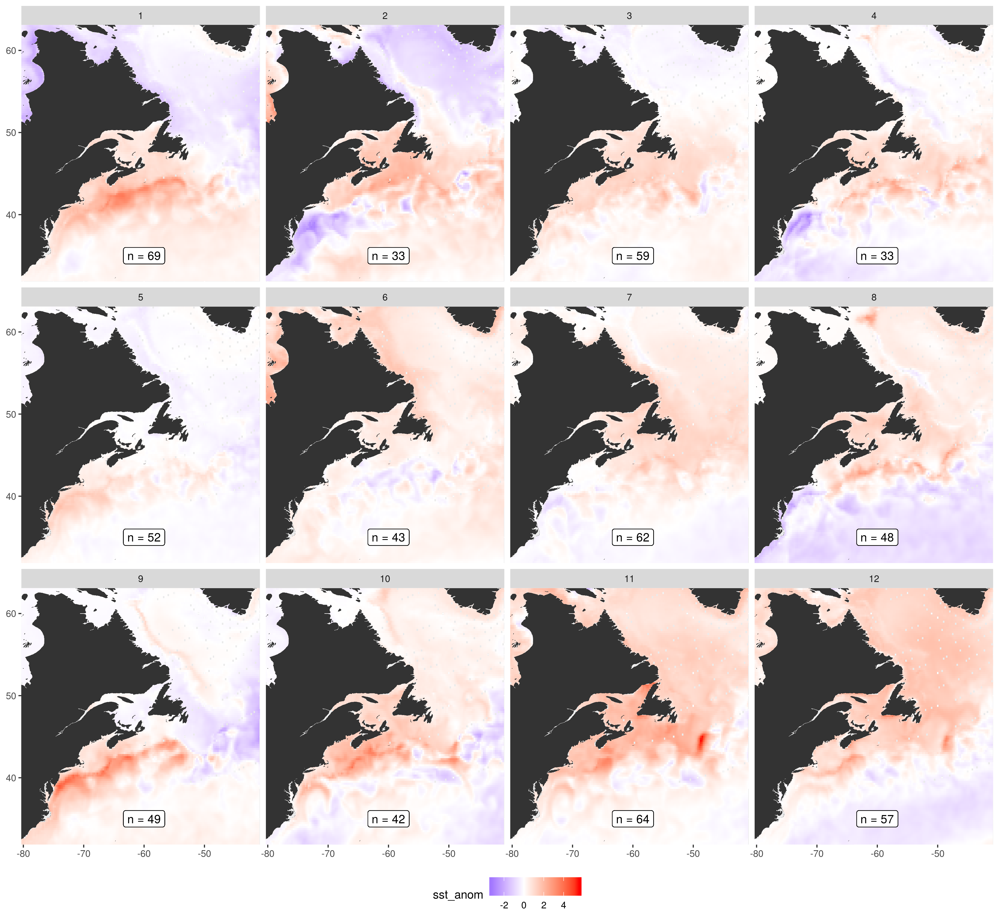

---
# PLEASE SEE THE README for in depth description github.com/brentthorne/posterdown
# IUGG size: 90 x 45 inches or 228 x 114 cm (landscape orientation)
poster_height: "45in"
poster_width: "90in"
font_family: 'Rasa'
#ESSENTIALS
title: '**Primary drivers of marine heatwaves in the Northwest Atlantic**'
author:
  - name: '**Robert W. Schlegel**'
    affil: 1,*
    main: true
    orcid: '0000-0002-0705-1287'
    twitter: wiederweiter 
    email: robert.schlegel@dal.ca
  - name: Eric C. J. Oliver
    affil: 1
affiliation:
  - num: 1
    address: Department of Oceanography, Dalhousie University, Halifax, Nova Scotia, Canada
#STYLE & FORMATTING
title_textsize: "125pt"
author_textsize: "1.17em"
authorextra_textsize: "35px"
affiliation_textsize: "25px"
affiliation_textcol: '#00000060'
caption_fontsize: "20pt"
#Middle of the poster
middle_fontfamily: "Special Elite"
middle_textcol: "#FFFFFF90"
middle_fontsize: "170px"
main_findings:
  - "When __marrine heatwaves__ occurr along the __Northwest Atlantic__ coast the __Gulf Stream__ anomaly is almost always __warm__ (cold) when the __Labrador Sea__ anomaly is __cold__ (warm)"
logoleft_name: "Figures/MHWNWA_QR.png"
logoright_name: "Figures/OFI_Dal_logo.png"
#---POSTER BODY OPTIONS---#
primary_colour: '#0b4545'
secondary_colour: '#008080' 
accent_colour: "#cc0000"
body_bgcol: "#FFFFFF"
body_textsize: "45px"
body_textcol: "#000000"
#--Standard Options--#
output: 
  posterdown::posterdown_betterland:
    self_contained: false
    pandoc_args: --mathjax
    highlight: espresso
    number_sections: false
link-citations: true
bibliography: MHWNWA.bib
---

<!-- TO DO
Write main statement
Create QR code
Create Dal OFI logo
Finish most text-->

```{r setup, include=FALSE}
knitr::opts_chunk$set(results = 'asis',
                      echo = FALSE,
                      warning = FALSE,
                      tidy = FALSE,
                      message = FALSE,
                      fig.align = 'center')
options(knitr.table.format = "html") 
```

# What are known drivers of past MHWs?

* Advection and heat flux are primary drivers of SST
* Different regions of the world show different primary drivers
* For much of the coastal oceans the primary driver is abnormal movement of warm currents onto the coast
* For large seas (i.e. the Mediterranean) warm air plays a more important role

# Why use a new method?

* Current standard is to analyse the drivers of one large event at a time
* Smaller events may also be important
* Events are happening too rapidly to spend a year working on them one at a time
* Machine learning may be a better choice moving forwards

## Sub/regions

- The coastline of Atlantic Canada was divided into several regions based on @Richaud2016
- These regions were then divided into three sub-regions each based on bottom depth:
  - 0 - 50 m
  - 50 - 200 m 
  - 200+ m


- The region abbreviations are: 
  - `gm` = Gulf of Maine 
  - `gls` = Gulf of St. Lawrence
  - `ls` = Labrador Shelf
  - `mab` = Mid-Atlantic Bight
  - `nfs` = Newfoundland Shelf 
  - `ss` = Scotian Shelf
  
  ## Calculating MHWs and creating synoptic states

- All of the SST pixels within each sub-region were averaged together into one time series
- MHWs were calculated from these averaged time series
- The start and end dates of each MHW were used to create a packet of synoptic state information


## Self-organising map

* Are there recurrent environmental patterns during marine heatwaves?
* If so, can these be detected/quantified by a computer?
* Anomalies fed to SOM to produce 12 most common states
* The occurrence of these states with sub-regions and/or seasons quantified

# What are the primary drivers? {.tabset}

## Broad view of SST

- The primary difference in synoptic SST states is between a warm (cold) Gulf Stream and cold (warm) Labrador Sea 
- We do not see a state during which the entire study area shows a warm SST signal



## Focus on node 9

* Strong warm nearshore Gulf Stream current
* Deeper mixed layer and negative downward heat flux
* Predominantly time series from the Mid-Atlantic Bight
* No seasonality, with more recent events increasing in intensity


# Conclusions

* The SOM technique functions as expected in the Northwest Atlantic
* The lack of a completely warm SST 'flavour' was surprising
* Each node tells a different complex story

# Future work

* Extend the methodology seen here into the third and fourth dimensions of the data
* Run this same analysis 1, 2, 3, etc. months prior to see how well it works
* Test these drivers (node synoptic states) as predictors for events in different data products
* Rank the drivers by their predictive accuracy
* Create operational prediction data layer for public use/consumption


```{r fig-1, out.width='70%', fig.align='center', fig.cap='The top panel shows the overall average SST and surface currents for the study area. The bottom panel shows the overall aveage net downward heatflux.'}
knitr::include_graphics("~/MHWNWA/talk/graph/fig_1.png")
```

```{r fig-1, out.width='70%', fig.align='center', fig.cap='The top panel shows the overall average SST and surface currents for the study area. The bottom panel shows the overall aveage net downward heatflux.'}
knitr::include_graphics("~/MHWNWA/talk/graph/fig_1.png")
```

```{r fig-2, out.width='70%', fig.align='center', fig.cap='The regions of the coast were devided up by their temperature and salinity regimes based on work by @Richaud2016. The region abbreviations are: gm = Gulf of Maine, gls = Gulf of St. Lawrence, ls = Labrador Shelf, mab = Mid-Atlantic Bight, nfs = Newfoundland Shelf, ss = Scotian Shelf. The regions were furthered divided into sub-regions based on their depth.'}
knitr::include_graphics("~/MHWNWA/talk/graph/fig_2.png")
```

```{r fig-3, out.width='70%', fig.align='center', fig.cap='Panel A shows an example MHW with the start and end dates marked in light green. Panel B shows the mean SST and ocean current anomalies during the MHW while panel C shows anomolous net downward heat flux, wind stress (O's are positive, X's are negative), and relative mixed layer depth. The region within which this event was detected is shown in black.'}
knitr::include_graphics("~/MHWNWA/talk/graph/fig_3.png")
```

```{r sst-panel-all, out.width='70%', fig.align='center', fig.cap='The resultant 12 nodes for SST only. Note how there are rarely any occurrences of a warm anomaly for the entire study area.'}
knitr::include_graphics("~/MHWNWA/talk/graph/fig_4.png")
```

```{r fig-4, out.width='70%', fig.align='center', fig.cap='Summary visuals for the results from node 9.'}
knitr::include_graphics("~/MHWNWA/talk/graph/fig_4.png")
```

# References
