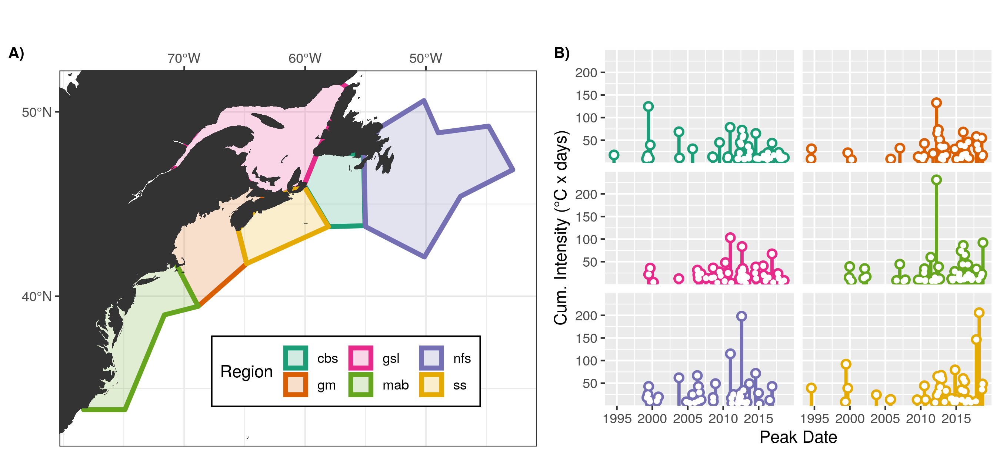

---
# Remember that this needs to be opened in Chrome to be viewed correctly and when creating the PDF
# OSM poster guidelines: https://www.agu.org/Ocean-Sciences-Meeting/Pages/Presenter-Guidelines#1
# Maximum Poster Dimensions: 45” x 45” (3.75 feet by 3.75 feet). 
# Each presenter will share an 8’W x 4’H poster board.
# Poster#: PC44C-1898
poster_height: "30in" # A1 23.39
poster_width: "45in" # A1 33.11
font_family: 'Rasa'
#ESSENTIALS
title: '**Primary Drivers of Marine Heatwaves in the Northwest Atlantic**'
author:
  - name: '**Robert W. Schlegel**'
    affil: 1,2,*
    main: true
    orcid: '0000-0002-0705-1287'
    twitter: robwschlegel 
    email: robert.schlegel@dal.ca
  - name: Ke Chen
    affil: 2
  - name: Eric C. J. Oliver
    affil: 1
affiliation:
  - num: 1
    address: Department of Oceanography, Dalhousie University, Halifax, Nova Scotia, Canada
  - num: 2
    address: Physical Oceanography Department, Woods Hole Oceanographic Institution, Woods Hole, Massachusetts, USA
#STYLE & FORMATTING
title_textsize: "100pt"
author_textsize: "1.17em"
authorextra_textsize: "30px"
affiliation_textsize: "20px"
affiliation_textcol: '#00000060'
caption_fontsize: "14pt"
reference_textsize: "10pt"
#Middle of the poster
middle_fontfamily: "Special Elite"
middle_textcol: "#FFFFFF90"
middle_fontsize: "170px"
main_findings:
  - "The most intense marine heatwaves occur during autumn/winter when atmospheric patterns look like summer marine heatwave conditions"
  # - "- Warm air sitting over entire coast"
  # - "- Warm air from southeast onto the coast"
  # - "- Warm Gulf Stream + air from south along coast"
# logoleft_name: '~/MHWNWA/poster/Figures/MHWNWA_QR.png{.main-img-left}'
# logoright_name: 'Figures/OFI_DAL_WHOI_logo.png{.main-img-right}'
# logoleft_name: '{.main-img-left}'
logoleft_name: "{.main-img-left}"
logoright_name: '{.main-img-right}'
#---POSTER BODY OPTIONS---#
primary_colour: '#0b4545'
secondary_colour: '#008080' 
accent_colour: "#cc0000"
body_bgcol: "#FFFFFF"
body_textsize: "32px"
body_textcol: "#000000"
#--Standard Options--#
output: 
  posterdown::posterdown_betterland:
    self_contained: false
    pandoc_args: --mathjax
    highlight: espresso
    number_sections: false
link-citations: true
csl: FMars.csl
bibliography: MHWNWA.bib
# biblio-style: authoryear
---

```{r setup, include=FALSE}
knitr::opts_chunk$set(results = 'asis',
                      echo = FALSE,
                      warning = FALSE,
                      tidy = FALSE,
                      message = FALSE,
                      fig.align = 'center')
options(knitr.table.format = "html") 
```

# Introduction

- Marine heatwaves (MHWs) are 5+ day long events when temperature anomalies exceed the 90th percentile climatology [@Hobday2016; @Hobday2018].  
- There are many different drivers of MHWs known around the world [e.g. @Olita2007; @Deser2010; @Bond2015a; @Schlegel2017predominant; @Oliver2018tasmania].  
- Are there common/recurrent drivers of MHWs in the NW Atlantic?  
- If so, can these be detected/clustered/quantified by a machine?  

# Methods

- SST pixels within each region of the coast (Figure \@ref(fig:fig-1)A) were meaned together into one time series.  
- MHWs were calculated from these 6 mean time series (Figure \@ref(fig:fig-1)B).  
- The start and end dates of each MHW were used to create mean synoptic air/sea state anomalies (Figure \@ref(fig:fig-2)).  
- These mean anomalies were fed to a self-organising map (SOM) to produce the 12 most common air/sea states (nodes). 
- Humans are then used to infer the drivers from the 12 nodes.

# Results

- To see all of the results please follow the QR code.  
- The node 9 results show a clear Nor'easter pattern (Figure \@ref(fig:fig-3)B).  
- The centre of the high SST anomaly (Figure \@ref(fig:fig-3)A) has a deepening MLD and negative downward heat flux (Figure \@ref(fig:fig-3)C).  
- Most MHWs occurred northwest of the centre of the SST anomaly (Figure \@ref(fig:fig-4)A) due to the downward heat flux and shoaling MLD (Figure \@ref(fig:fig-3)C). 
- None of these events occurred in summer (Figure \@ref(fig:fig-4)B), and nearly half occurred on the Newfoundland Shelf (Figure \@ref(fig:fig-4)C).  

# Conclusions

- The nodes show three predominant patterns:
  - Warm Gulf Stream + air pushing up from south along the coast.
  - Warm air sitting over the entire coast during summer.
  - Warm air pushed over the Atlantic from the southeast onto the coast.
- The most intense MHWs occur during Autumn/Winter when large scale atmospheric patterns look like Summer MHW conditions.

<!-- - The SOM technique functions better in the Northwest Atlantic if the Labrador Sea is excluded from the study area. -->
<!--   - This is important to note as it supports the argument that this methodology is limited in scale.   -->
<!--   - It is likely that this SOM technique will not work on scales larger than one meso-scale feature at a time.   -->

```{r fig-1, out.width='80%', fig.align='center', fig.cap='The regions of the study area and the marine heatwaves (MHWs) detected within them. The region abbreviations are: gm = Gulf of Maine, gls = Gulf of St. Lawrence, ls = Labrador Shelf, mab = Mid-Atlantic Bight, nfs = Newfoundland Shelf, ss = Scotian Shelf. A) The regions of the coast were divided up by their temperature and salinity regimes based on work by @Richaud2016. B) The SST pixels within each region were averaged to one time series before detecting MHWs with the @Hobday2016 definition.'}

```

```{r fig-2, out.width='100%', fig.align='center', fig.cap='The information generated for a single MHW. The region of the focus event is shown as a purple polygon. A) Start and end dates of the focal MHW are marked in green. B) Mean SST and surface current anomalies during the MHW. C) Mean air temperature, MSLP, and wind anomalies. D) Mean MLD and Qnet anomalies.'}
knitr::include_graphics("~/MHWNWA/talk/graph/synoptic_gm_14.png")
```

```{r fig-3, out.width='100%', fig.align='center', fig.cap='The mean environmental states for all MHWs clustered into node 9. A) Mean SST and surface current anomalies. Regions overlaid with black polygons and bathymetry down to 2000 m shown with black contours. B) Mean air temperature, MSLP, and wind anomalies. F) Mean MLD and Qnet anomalies.'}
knitr::include_graphics("node_9_anom.png")
```

```{r fig-4, out.width='100%', fig.align='center', fig.cap='MHW information for node 9. A) Regions and seasons of occurrence. B) Cumulative intensity and season of occurrence for each MHW. Linear models show range of dates for MHWs and the secular trend in their cumulative intensity. C) Max intensity and region of occurrence for each MHW. Linear models show range of dates of occurrence for MHWs and secular trend in max intensity.'}

```

# References
