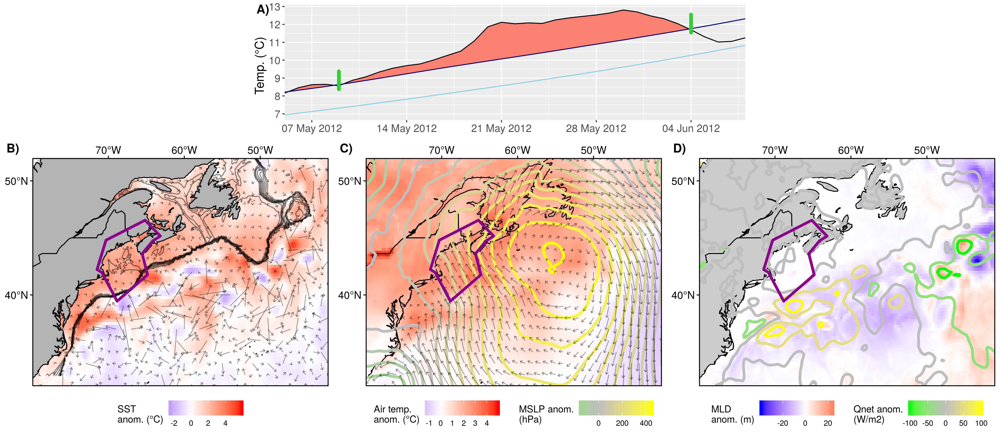
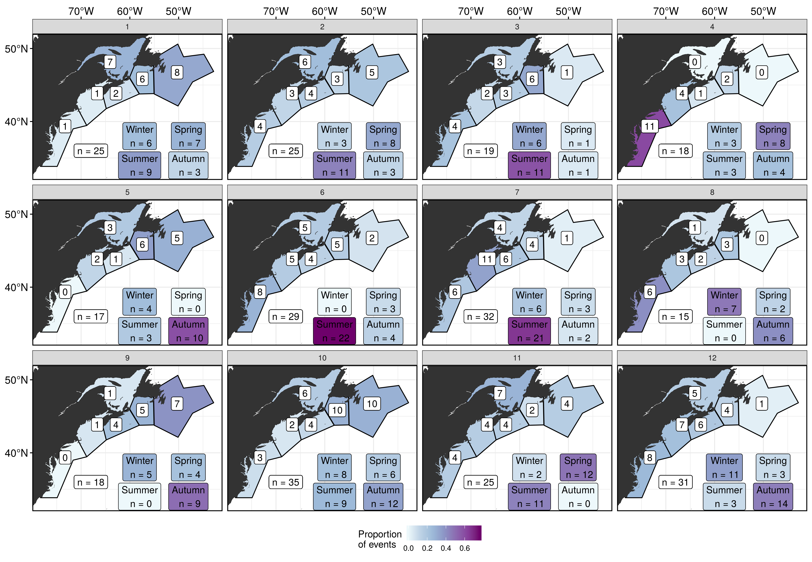

```{r setup, include=FALSE}
knitr::opts_chunk$set(echo = FALSE)
```

# Introduction

## Marine heatwaves (MHWs): definition

<!-- ### Definition -->

<br>

<font size="5">"A prolonged discrete anomalously warm water event that can be described by its duration, intensity, rate of evolution, and spatial extent." </font>  
  
[@Hobday2016]

<br>
  
* The temperature at a location exceeds the 90% percentile of that calendar day    
* This occurs at least 5 days in a row with no more than a 2 day gap thereafter  

## Marine heatwaves (MHWs): schematic
<!-- ### Schematic -->

<center>
{ width=90% }  
(_Eric Oliver, www.marineheatwaves.org_)
</center>

## Known drivers and effects of past MHWs

* Mediterranean 2003
  * Driver - Atmospheric forcing  
  * Effect - Gorgonian mortality up to 80% [@Garrabou2009]

* Western Australia 2011
  * Driver - La Nina + Abnormal Leeuwin Current movement onto coast  [@Feng2013; @Benthuysen2014]
  * Effect - Permanent loss of 100+ km of kelp forest [@Wernberg2016]  

* Northwest Atlantic 2012
  * Driver - Atmos. forcing due to anomalous jet stream [@Chen2015a]
  * Driver - Labrador Current vs. Gulf Stream [@Brickman2018]
  * Effect - Range shifts, early lobsters, CAN vs. USA [@Mills2013]

<!-- * "The Blob" California Current 2014-16 -->
<!--   * Driver - Warm winter, poor mixing, high SLP, air-sea flux, then an El Nino [@Bond2015a] -->
<!--   * Effect - Practically every trophic level negatively impacted to some degree -->

# Methods

## Departure from established methodology

* Primary drivers are generally determined by analysing the physical state during a single MHW
* Large MHWs are happening too rapidly to spend a year+ working on them one at a time
* Smaller events may also be important
* The use of self-organising maps (SOM) to identify MHW drivers has already been tested
* This technique allows a machine to show us which drivers are most prominent during hundreds of MHWs
* We are asking two questions:
  1. Are there recurrent environmental patterns during MHWs?
  2. If so, can these be detected/quantified by the computer?

## Data

- NOAA OISST
  - Sea surface temperature (SST; °C)
- GLORYS
  - Mixed layer depth (MLD; m)
  - Surface ocean currents (U and V; m/s)
  - Mean sea level pressure (MSLP; hPa) **- NOT USED IN SOM**
- ERA 5
  - Surface air temperature (t2m; °C)
  - Net positive downward heat flux (Q~net~; W/m2)
    - Latent + sensible heat flux + short + long-wave radiation (Q~e~ + Q~h~ + Q~s~ + Q~l~)
  - Surface wind currents (U and V; m/s)

## Study area

{ width=70% }  
[@Richaud2016]

## MHW detection

* Total of 298 MHWs calculated from the time series averaged over the pixels in the six regions

<center>
{ width=80% }  
</center>

## Data packets

* Data packet of mean anomalous air/sea state created for each MHW
* 289 data packets fed to SOM to produce 12 most common synoptic air/sea patterns

<!-- * These packets consisted of the mean anomalous air/sea state during that MHW -->
<!-- * The physical variables in these packets were: SST, U, V, t2m, U10, V10, MLD, Q~net~ -->

<center>
{ width=90% }  
</center>

# Results

## All nodes

{ width=90% }  

## Node 9

{ width=90% }  

# Conclusions

* The nodes tell three main stories:
  * Warm GS + air pushing up from south along coast
  * Warm air sitting over entire coast
  * Warm air being pushed over the AO from the South/Southeast onto the coast
* A few nodes tell smaller stories:
  * Short lived storms that barely manage to perturb T~mix~ for long enough to qualify as a MHW
  * These are distinctly different from the patterns associated with intense MHWs
* Overall the most intense MHWs occur during Autumn/Winter when they match patterns that are normally seen in Summer
* It is likely that this SOM technique will not work on scales larger than one meso-scale feature at a time

## Acknowledgements

\begin{columns}
\begin{column}{0.33\textwidth}
    \begin{center}
     \includegraphics[width=0.9\textwidth]{graph/ofi_logo.jpg}
     \end{center}
\end{column}
\begin{column}{0.33\textwidth}
    \begin{center}
     \includegraphics[width=0.9\textwidth]{graph/dal_science.png}
     \end{center}
\end{column}
\begin{column}{0.33\textwidth}
    \begin{center}
     \includegraphics[width=0.9\textwidth]{graph/WHOI_logo.png}
     \end{center}
\end{column}
\end{columns}

## References {.allowframebreaks} 
