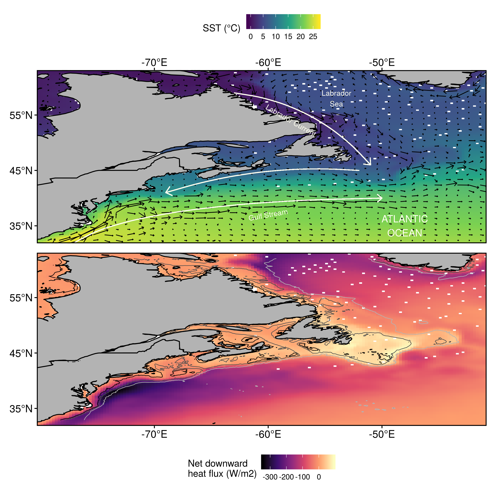

<!--  -->

***

# Introduction

## What are marine heatwaves? 

<!-- ## Definition -->

"A prolonged discrete anomalously warm water event that can be described by its duration, intensity, rate of evolution, and spatial extent."   
  
[@Hobday2016]

 

{ width=90% }  
(_Eric Oliver, www.marineheatwaves.org_)

  
* The temperature at a location exceeds the 90% percentile of that calendar day    
* This occurs at least 5 days in a row with no more than a 2 day gap thereafter    

## In practice

[Marine Heatwave Tracker](http://www.marineheatwaves.org/tracker)

## Databases
  

{ width=100% }  

* One may also download marine heatwave results from the daily updating Marine Heatwave Tracker
    * Contains climatologies, event metrics, and categories

## What causes them?

* Different regions of the world show different primary drivers
* For much of the coastal oceans the primary driver is abnormal movement of warm currents onto the coast
* For large seas (i.e. the Mediterannean) warm air plays a more important role

## What are the drivers for MHWs in the NW Atlanttic?

# Methods {.tabset}

## Sub/regions

- The coastline of Atlantic Canada was divided into several regions based on @Richaud2016
- These regions were then divided into three sub-regions each based on bottom depth:
  - 0 - 50 m
  - 50 - 200 m 
  - 200+ m

## SST time series

- All of the SST data for pixels within each sub-region were averaged together

## Marine heatwaves (MHWs)

- MHWs calculated from each average SST time series

## Synoptic states

- Average anomaly abiotic synoptic states created during each MHW

## Self-organising map

- Anomalies fed to SOM to produce 12 most common states
- The occurrence of these states with sub-regions and/or seasons quantified

## Machine learning {.tabset}

* Are there recurrent environmental patterns during marine heatwaves?
* If so, can these be detected/quantified by a computer?

### Definition 

{ width=60% }

    
  
"A field of study concerned with the design and development of algorithms and techniques that allow computers to learn."     
(_Wiktionary_)

***

### Stress

{ width=110% }

 

* The computer "learns" by reducing stress

***

### Clustering

 
  
(_Angé Ackerman_)

 

* After ordinating the data the computer tries to find the most similar clusters for them

***

### Self-organising maps {.tabset}

#### Self-organising cats

 
  
(_Angé Ackerman_)

 

* With self-organising maps the computer then arranges the clusters

***

<!-- ### Time series -->
<!-- 
 -->
<!-- { width=90% } -->
<!-- 
   -->
  
<!-- * First we start with a normal temperature time series -->
    <!-- * Temperature (°C) on the y-axis, date on the x-axis -->

<!-- ### Day of year -->
<!-- 
 -->
<!-- { width=90% } -->
<!-- 
 -->
  
<!-- * Then we clump all of the same days of the year (doy) together -->
<!-- * The range of values for each doy are shown here as boxplots -->

<!-- ### Climatologies -->
<!-- 
 -->
<!-- { width=90% } -->
<!-- 
 -->
  
<!-- * We smooth these values with an 11-day moving average while finding the: -->
    <!-- * mean _seasonal signal_ (blue line) & 90th percentile _threshold_ (red line) -->
<!-- * These both are then smoothed with a 31-day moving average -->

# Results {.tabset}

- The primary difference in synoptic states is a dipole between a warm (cold) Gulf Stream and cold (warm) Labrador Sea (Figure \@ref(fig:synoptic-sst))
- More nuanced patterns are .....
- Sub-mesoscale patterns are ......
- By season ......
- By region ......

<!-- ### Events -->
<!-- 
 -->
<!--  -->
<!-- 
 -->
  
<!-- * Any temperatures above the _threshold_ for 5+ days are marked as a marine heatwave -->

<!-- ### Categories -->
<!-- 
 -->
<!--  -->
<!-- 
 -->

<!-- * There is also a more qualitative ranking system [@Hobday2018] -->

<!-- ### Event metrics -->
<!-- 
 -->
<!--  -->
<!-- 
 -->
  
<!-- * Summary metrics for each event are created -->
<!-- * Here the max intensity of each event is shown with a lolliplot -->

<!-- ## Programming languages -->

<!-- * It is currently possible to calculate marine heatwaves in: -->
    <!-- * Python: <https://github.com/ecjoliver/marineHeatWaves> -->
    <!-- * R: <https://robwschlegel.github.io/heatwaveR/index.html> -->
    <!-- * MATLAB: <https://github.com/ZijieZhaoMMHW/m_mhw1.0> -->

# Where are we going?

* Find common global patterns between marine heatwaves and environmental variables
    * Move towards methods of prediction
* Database for quantified effects of marine heatwaves on biology/ecology/fisheries
    * Expand the applicability of the Marine Heatwave Tracker
* Begin using models and reanalyses to understand depth of marine heatwaves

***

# Acknowledgements

 

  
  
  
 
  
  

***

# Questions {.tabset}

## Thank you

{ width=120% }

***

## Marine cold-spells

  

***

## Ordination

{ width=90% }

  
* Note how the daily synoptic states form a smooth ellipsoid
* Then note how scattered the marine heatwave synoptic states are

***

# References
