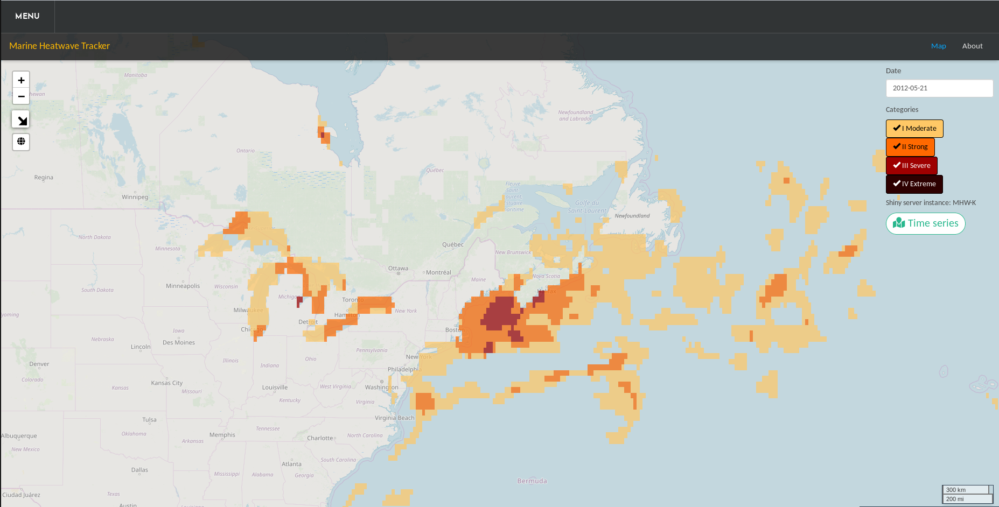
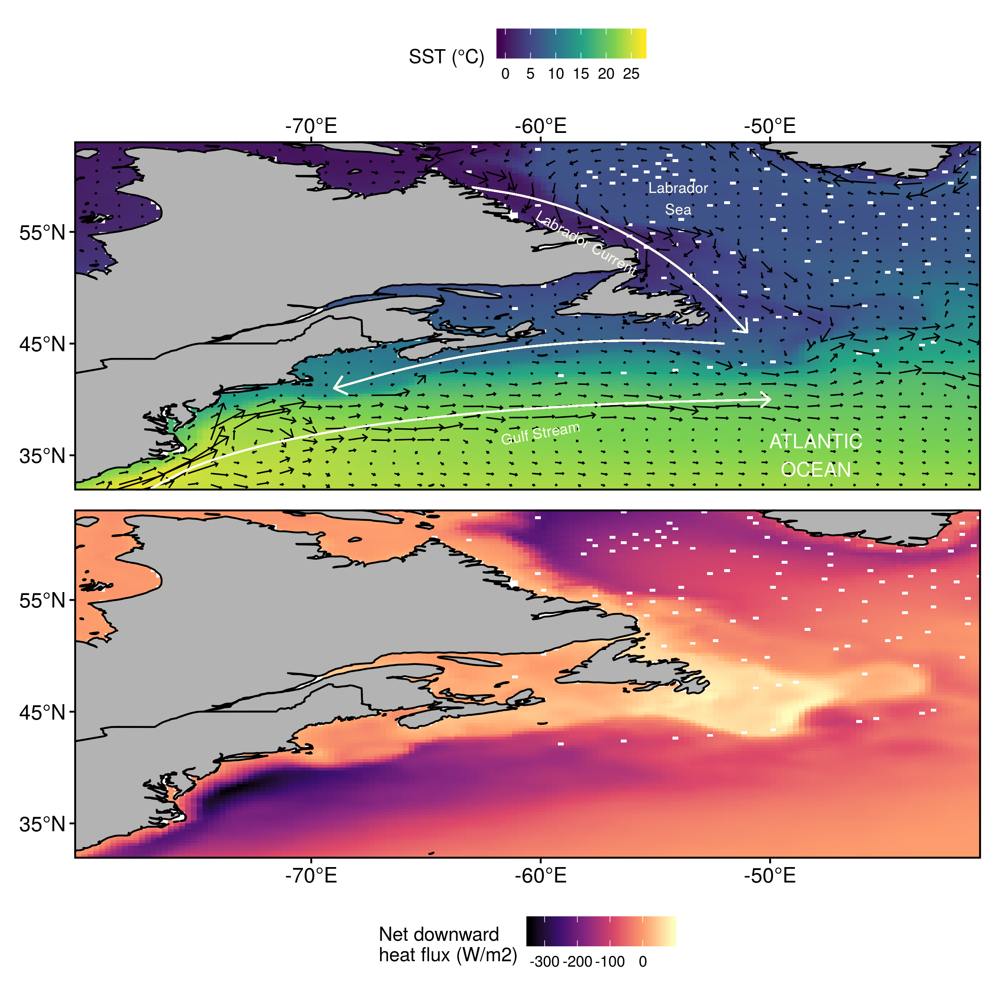
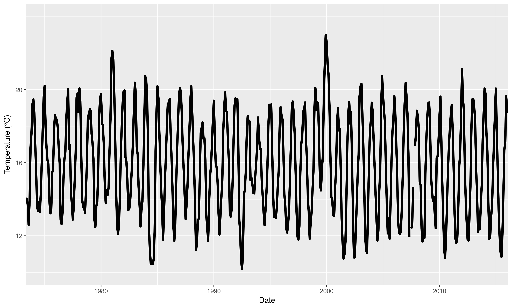
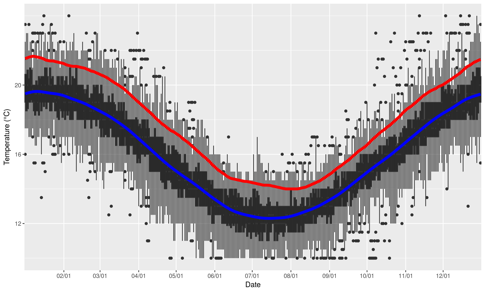

<!--  -->

***

# What are marine heatwaves? 

<!-- ## Definition -->

"A prolonged discrete anomalously warm water event that can be described by its duration, intensity, rate of evolution, and spatial extent."   
  
[@Hobday2016]

 

{ width=90% }  
(_Eric Oliver, www.marineheatwaves.org_)

  
* The temperature at a location exceeds the 90% percentile of that calendar day    
* This occurs at least 5 days in a row with no more than a 2 day gap thereafter    

{ width=100% }  

* One may also download marine heatwave results from the daily updating Marine Heatwave Tracker
    * www.marineheatwaves.org/tracker
    * Contains climatologies, event metrics, and categories

***

# What are known drivers of past MHWs?

* Advection and heat flux are primary drivers of SST
* Different regions of the world show different primary drivers
* For much of the coastal oceans the primary driver is abnormal movement of warm currents onto the coast
* For large seas (i.e. the Mediterranean) warm air plays a more important role

***

# Why use a new method?

* Current standard is to analyse the drivers of one large event at a time
* Smaller events may also be important
* Events are happening too rapidly to spend a year working on them one at a time
* Machine learning may be a better choice moving forwards

***

# What data are we using?

- NAPA (3-Oceans) model
  - Model outputs supplied by the Bedford Institute of Oceanography (BIO) 
  - Based on the NEMO community ocean model 
- Daily surface resolution
- Five day (pentad) resolution at 75 depth layers
- Tri-polar grid
  - 10 to 20 km resolution

(_courtesy Timothée Bourgeois_)
- Variable of interest:
  - Sea surface temperature (SST; °C)
  - Net downward heat flux (Q; W/m2)
  - Mixed layer depth (mld, dsigma = 0.01 wrt 10m)
  - Surface wind stress (tau m; N/m2)
  - Surface ocean currents (U and V; m/s)

# How are we using these data?

## Study area

## Sub/regions

- The coastline of Atlantic Canada was divided into several regions based on @Richaud2016
- These regions were then divided into three sub-regions each based on bottom depth:
  - 0 - 50 m
  - 50 - 200 m 
  - 200+ m

- The region abbreviations are: 
  - `gm` = Gulf of Maine 
  - `gls` = Gulf of St. Lawrence
  - `ls` = Labrador Shelf
  - `mab` = Mid-Atlantic Bight
  - `nfs` = Newfoundland Shelf 
  - `ss` = Scotian Shelf
  
## Calculating MHWs and creating synoptic states

- All of the SST pixels within each sub-region were averaged together into one time series
- MHWs were calculated from these averaged time series
- The start and end dates of each MHW were used to create a packet of synoptic state information

## Self-organising map

* Are there recurrent environmental patterns during marine heatwaves?
* If so, can these be detected/quantified by a computer?
* Anomalies fed to SOM to produce 12 most common states
* The occurrence of these states with sub-regions and/or seasons quantified

# What are the primary drivers? {.tabset}

## Broad view of SST

- The primary difference in synoptic SST states is between a warm (cold) Gulf Stream and cold (warm) Labrador Sea 
- We do not see a state during which the entire study area shows a warm SST signal

## Focus on node 9

* Strong warm nearshore Gulf Stream current
* Deeper mixed layer and negative downward heat flux
* Predominantly time series from the Mid-Atlantic Bight
* No seasonality, with more recent events increasing in intensity

***

# Conclusions

* The SOM technique functions as expected in the Northwest Atlantic
* The lack of a completely warm SST 'flavour' was surprising
* Each node tells a different complex story

***

# Future work

* Extend the methodology seen here into the third and fourth dimensions of the data
* Run this same analysis 1, 2, 3, etc. months prior to see how well it works
* Test these drivers (node synoptic states) as predictors for events in different data products
* Rank the drivers by their predictive accuracy
* Create operational prediction data layer for public use/consumption

***

# Acknowledgements

## Funding

  
  

  
## University

  

## Model support

Prof. Youyu Lu
  
Dr. Xianmin Hu

Dr. Timothée Bourgeois

***

# Questions {.tabset}

## Thank you

{ width=120% }

***

## Calculating marine heatwaves (MHWs) {.tabset}

### Time series

{ width=90% }

* First we start with a normal temperature time series
* Temperature (°C) on the y-axis, date on the x-axis

### Day of year

{ width=90% }

* Then we clump all of the same days of the year (doy) together
* The range of values for each doy are shown here as boxplots

### Climatologies

{ width=90% }

* We smooth these values with an 11-day moving average while finding the:
* mean _seasonal signal_ (blue line) & 90th percentile _threshold_ (red line)
* These both are then smoothed with a 31-day moving average

***

## Machine learning {.tabset}

* Are there recurrent environmental patterns during marine heatwaves?
* If so, can these be detected/quantified by a computer?

### Definition 

{ width=60% }

    
  
"A field of study concerned with the design and development of algorithms and techniques that allow computers to learn."     
(_Wiktionary_)

***

### Stress

{ width=110% }

 

* The computer "learns" by reducing stress

***

### Clustering

 
  
(_courtesy Angé Ackerman_)

 

* After ordinating the data the computer tries to find the most similar clusters for them

***

### Self-organising maps {.tabset}

#### Self-organising cats

 
  
(_courtesy Angé Ackerman_)

 

* With self-organising maps the computer then arranges the clusters

***

## Ordination

{ width=90% }

  
* Note how the daily synoptic states form a smooth ellipsoid
* Then note how scattered the marine heatwave synoptic states are

***

# References
