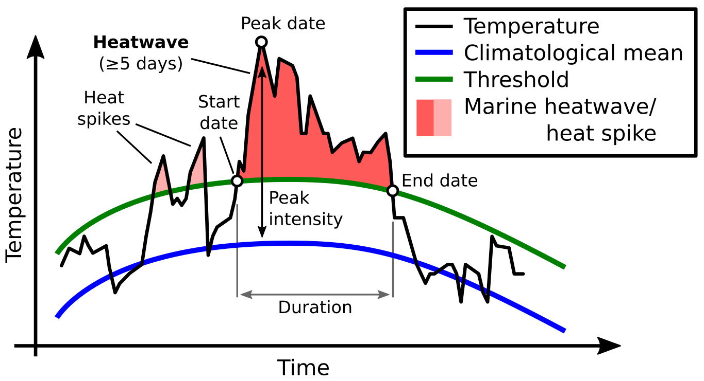
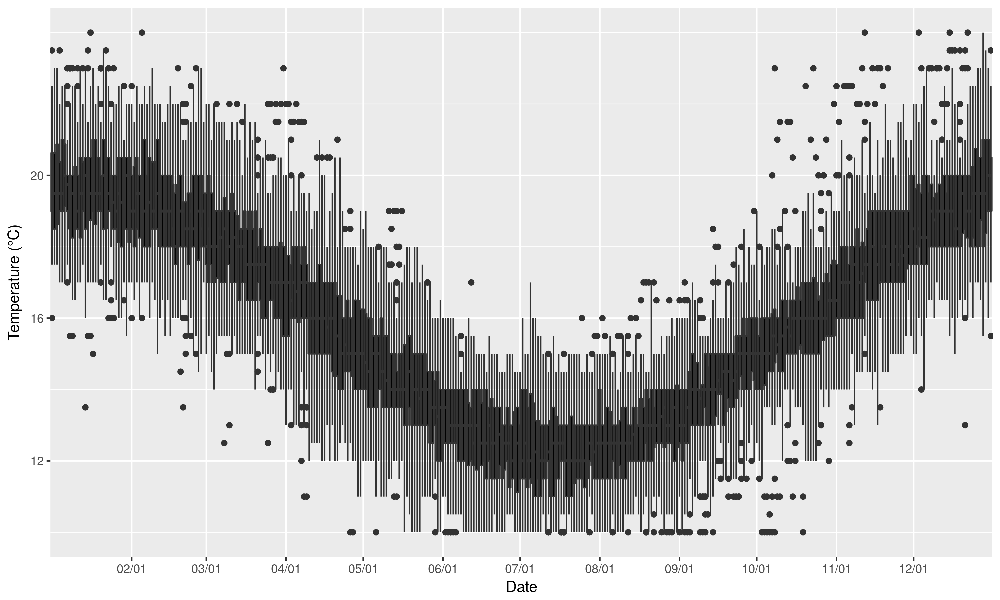

***

# What are marine heatwaves? 

## Definition

"A prolonged discrete anomalously warm water event that can be described by its duration, intensity, rate of evolution, and spatial extent."   
  
[@Hobday2016]

 

{ width=90% }  
(_Eric Oliver, www.marineheatwaves.org_)

  
* The temperature at a location exceeds the 90% percentile of that calendar day    
* This occurs at least 5 days in a row with no more than a 2 day gap thereafter    

## Methods {.tabset}

### Time series

{ width=90% }

  
  
* First we start with a normal temperature time series
    * Temperature (°C) on the y-axis, date on the x-axis

### Day of year

{ width=90% }

  
* Then we clump all of the same days of the year (doy) together
* The range of values for each doy are shown here as boxplots

### Climatologies

{ width=90% }

  
* We smooth these values with an 11-day moving average while finding the:
    * mean _seasonal signal_ (blue line) & 90th percentile _threshold_ (red line)
* These both are then smoothed with a 31-day moving average

## Results {.tabset}

### Events

  
* Any temperatures above the _threshold_ for 5+ days are marked as a marine heatwave

### Categories

* There is also a more qualitative ranking system [@Hobday2018]

### Event metrics

  
* Summary metrics for each event are created
* Here the max intensity of each event is shown with a lolliplot

## In practice

[Marine Heatwave Tracker](http://www.marineheatwaves.org/tracker)

***

# Why should we care? 
  
* Marine heatwaves are increasing in duration and intensity globally [@Oliver2018]
* We already know of many marine heatwaves that have had dire consequences

## Infamous marine heatwaves {.tabset}

### Mediterranean - 2003

{ width=70% }

* Cause - Atmospheric forcing  
* Effect - Gorgonian mortality up to 80% [@Garrabou2009]

### Western Australia - 2010/11

  
(_Thomas Wernberg_)

  
  
* Cause - La Nina + Abnormal Leeuwin Current movement onto coast  [@Feng2013; @Benthuysen2014]
* Effect - Permanent loss of more than 100 km of kelp forests [@Wernberg2016]

### North West Atlantic - 2012

* Cause - Interactions between Labrador Current and Gulf Stream [@Brickman2018]
* Effect - Range shifts, early lobsters, CAN vs. USA [@Mills2013]

### "The Blob" North East Pacific - 2014/16

{ width=70% }  
(_EPA_)

  
  
* Cause - Warm winter, poor mixing, high SLP, air-sea flux, followed by an El Nino [@Bond2015a]
* Effect - Practically every trophic level negatively impacted to some degree

***

# What are we doing about it?

## International Working Group

  

## Programming languages

* It is currently possible to calculate marine heatwaves in:
    * Python: <https://github.com/ecjoliver/marineHeatWaves>
    * R: <https://robwschlegel.github.io/heatwaveR/index.html>
    * MATLAB: <https://github.com/ZijieZhaoMMHW/m_mhw1.0>

## Databases
  

{ width=100% }  

* One may also download marine heatwave results from the daily updating Marine Heatwave Tracker
    * Contains climatologies, event metrics, and categories

## Machine learning {.tabset}

* Are there recurrent environmental patterns during marine heatwaves?
* If so, can these be detected/quantified by a computer?

### Definition 

{ width=60% }

    
  
"A field of study concerned with the design and development of algorithms and techniques that allow computers to learn."     
(_Wiktionary_)

***

### Stress

{ width=110% }

 

* The computer "learns" by reducing stress

***

### Clustering

 
  
(_Angé Ackerman_)

 

* After ordinating the data the computer tries to find the most similar clusters for them

***

### Self-organising maps {.tabset}

#### Self-organising cats

 
  
(_Angé Ackerman_)

 

* With self-organising maps the computer then arranges the clusters

***

#### Methods {.tabset}

##### Study area

***

##### Synoptic states

***

<!-- ##### Anomalous states -->

<!-- 
 -->
<!--  -->
<!-- 
 -->

<!-- *** -->

#### Results

 

 

***

#### Choice {.tabset}

##### Oceanic forcing

 

 

***

##### Atmospheric forcing

 

 

***

# Where are we going?

* Find common global patterns between marine heatwaves and environmental variables
    * Move towards methods of prediction
* Database for quantified effects of marine heatwaves on biology/ecology/fisheries
    * Expand the applicability of the Marine Heatwave Tracker
* Begin using models and reanalyses to understand depth of marine heatwaves

***

# Acknowledgements

 

  
  
  
 
  
  
  
 
  
{ width=60% }

***

# Questions {.tabset}

## Thank you

{ width=120% }

***

## Marine cold-spells

  

***

## Ordination

{ width=90% }

  
* Note how the daily synoptic states form a smooth ellipsoid
* Then note how scattered the marine heatwave synoptic states are

***

# References
