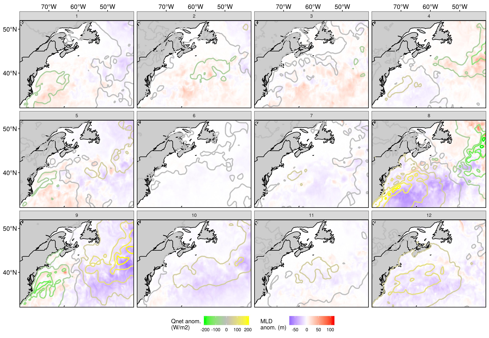

<!--  -->

***

```{r setup, echo=FALSE, warning=FALSE, message=FALSE}
library(tidyverse, quietly = T)
```


# What are marine heatwaves? 

<!-- ## Definition -->

<font size="5">"A prolonged discrete anomalously warm water event that can be described by its duration, intensity, rate of evolution, and spatial extent." </font>  
  
[@Hobday2016]

<br>

<center>
{ width=90% }  
(_Eric Oliver, www.marineheatwaves.org_)
</center>
  
* The temperature at a location exceeds the 90% percentile of that calendar day    
* This occurs at least 5 days in a row with no more than a 2 day gap thereafter    

<center>
{ width=100% }  
</center>

* One may also download marine heatwave results from the daily updating Marine Heatwave Tracker
    * www.marineheatwaves.org/tracker
    * Contains climatologies, event metrics, and categories

***

# How does heat enter/exit the ocean?

Surface heat flux (W/m^2^):

* Q~s~: The short wave energy radiated from the sun (shortwave radiation)  
* Q~l~: The net long-wave energy radiated back from the ocean (longwave radiation)  
* Q~e~: The heat loss by evaporation (latent heat flux)  
* Q~h~: The sensible heat loss by conduction (sensible heat flux)
* Q~net~ = Q~s~ + Q~l~ + Q~e~ + Q~h~ (net positive downward heat flux)

Mixed layer depth:

* H: MLD (mixed-layer depth)
* T~mix~: MLD temperature
* ρ~0~: Density of sea water
* c~p~: Specific heat of sea water

Surface movement: 

* **u~mix~** = (u~mix~, v~mix~): Horizontal velocity averaged within the mixed layer
* ∇~h~ = (∂/∂x, ∂/∂y): Horizontal gradient operator
* **u~mix~**$\cdot$∇~h~T~mix~ = Temperature change due to horizontal advection

Surface temperature:

* $\delta$T~mix~ /  $\delta$t = ( (Q~net~ - (Q~s~(-H))) / ρ~0~c~p~H ) - **u~mix~**$\cdot$$\nabla$~h~T~mix~ + (*res*)

[@Benthuysen2014; @Chen2015a; @Oliver2017]

***

# What are known drivers of past MHWs?

* Advection and heat flux are primary drivers of SST
* Newer research is only now looking into the effects of the MLD
* Different regions of the world show different primary drivers
* For much of the coastal oceans the primary driver is abnormal movement (advection) of warm currents into the nearshore
* For large seas (i.e. the Mediterranean) warm air (heat flux) plays a more important role
* The primary drivers of MHWs are generally determined by analysing the contribution of heat budget terms to the occurrence of one large event at a time

***

# What is problematic with the current methodology?

* Large MHWs are happening too rapidly to spend a year working on them one at a time
* Smaller events may also be important
* Machine learning may be a better choice moving forwards
* The use of self-organising maps (SOM) to identify MHW drivers has already been tested
* This technique allows a machine to clarify for us which drivers are most prominent during hundreds of MHWs simultaneously

***

# What is our methodology?

* We first detect MHWs in a given area
* Data packets of synoptic air/sea state anomalies during these MHWs are then fed to a SOM
* This machine learning technique outputs for us the most common states during MHWs
* We interpret the SOM results to deduce what the primary drivers of MHWs are

## Data

It is necessary to use three different remote/reanalysis products in order to incorporate the main mixed layer temperature heat budget terms into this research. Those products and their variables are:

- NOAA OISST
  - Sea surface temperature (SST; °C)
- GLORYS
  - Mixed layer depth (MLD; -m)
  - Surface ocean currents (U and V; m/s)
  - Mean sea level pressure (MSLP) **- NOT USED IN SOM**
- ERA 5
  - Surface air temperature (t2m; °C)
  - Net positive downward heat flux (Q~net~; W/m2)
    - Latent + sensible heat flux + short + long-wave radiation (Q~e~ + Q~h~ + Q~s~ + Q~l~)
  - Surface wind currents (U and V; m/s)

The spatial grid resolution is 0.25 lon/lat and the temporal resolution is daily.

## Study area/regions

- The coastline of Atlantic Canada was divided into several regions based on their SST and SSS climatologies [@Richaud2016]


- The region abbreviations are: 
  - `cbs` = Cabot Strait **- CREATED FOR THIS PROJECT**
  - `gm` = Gulf of Maine 
  - `gls` = Gulf of St. Lawrence
  - `ls` = Labrador Shelf **- NO LONGER USED**
  - `mab` = Mid-Atlantic Bight
  - `nfs` = Newfoundland Shelf 
  - `ss` = Scotian Shelf

## Calculating MHWs

- All of the SST pixels within each region were averaged together into one time series
- MHWs were calculated from these six averaged time series
- A total of 289 MHWs were detected
- The distribution of the occurrence of MHWs and their intensities are left-skewed


## Creating data packets

- The start and end dates of each MHW were used to create a packet of synoptic state information
- These packets contained one mean anomaly value per pixel per variable for the entire study area
  - The variables are: SST, U, V, t2m, U10, V10, MLD, Q~net~
- Anomalies were calculated by subtracting the daily climatology per pixel per variable from the base daily values
- Climatologies were calculated using the @Hobday2016 methodology

## Self-organising map

* Are there recurrent environmental patterns during marine heatwaves?
* If so, can these be detected/quantified by a computer?
* Data packets of synoptic state anomalies fed to SOM to produce 12 most common states
* The occurrence of these states with regions and/or seasons quantified

***

# What are the primary drivers? {.tabset}

## Schematic overview


General patterns:

* Columns: 
  * Northeastern regions affected in the left columns, southwestern regions to the right  
  * Low pressure (storms) to the left, high pressure (blocking) to the right  
  * Cyclonic wind movement to left, anticyclonic to right
  * Cold (warm) air over land (ocean) to the left, roughly opposite to the right  
  * Deeper (shallower) GS (LS) with positive (negative) Q~net~ to the left, roughly transitions to the opposite state to the right  
  
* Rows:  
  * Cold AO in the top rows, warms to the bottom  
  * Larger proportion of the study area shows positive MLD anomaly in top rows, reverses towards bottom  
  
* Other:  
  * The centre two nodes show summer events  

***

## Regions + seasons


***

## SST + U + V (real)


***

## SST + U + V (anom)


***

## Air + U + V + MSLP (real)


***

## Air + U + V + MSLP (anom)


***

## Qnet + MLD (anom)



***

## Summary stats heatmap


***

## Max intensity + region


***

## Cumulative intensity + season


***

## Duration


***

## Summary tables {.tabset}

### Meta-data

```{r meta-table, echo=FALSE}
# Region info
node_region <- data.frame(Node = c(1:12),
                          Region = c("nfs focus; 2 ss; 1 gm + mab",
                                     "Even split; fewer gm + cbs",
                                     "Even split; focus cbs; 2 gm; 1 nfs",
                                     "mab focus; 0 gsl + nfs",
                                     "cbs + nfs focus; little else; 0 mab",
                                     "mab focus; 2 nfs",
                                     "gm focus; 1 nfs",
                                     "mab focus; 1 cbs; 0 nfs",
                                     "nfs focus; 1 cbs + gm; 0 mab",
                                     "nfs + cbs focus",
                                     "gsl focus; little cbs",
                                     "mab focus; 1 nfs"),
                          stringsAsFactors = F)

# Season info
node_season <- data.frame(Node = c(1:12),
                          Season = c("Summer focus; little Autumn",
                                     "Summer + Spring; little Autumn + Winter",
                                     "Summer focus + Winter",
                                     "Spring focus; little else",
                                     "Autumn focus; little else; no Spring",
                                     "SUMMER; no Winter",
                                     "SUMMER; little else",
                                     "Winter + Autumn; no Summer",
                                     "Autumn; some Winter + Spring; no Summer",
                                     "Autumn focus, little Spring",
                                     "Spring + Summer; no Autumn",
                                     "Autumn + Winter; little else"),
                          stringsAsFactors = F)

# Count and years of occurrence info
node_meta <- data.frame(Node = c(1:12),
                        Meta = c("25; 1999, 2004 - 2018",
                                 "25; 2000 - 2016",
                                 "19; 2006 - 2017",
                                 "18; 1994, 2014 - 2018",
                                 "17; 1999, 2012 - 2018",
                                 "29; 1994, 2006 - 2018",
                                 "32; 2009 - 2018",
                                 "15; 2002, 2015 - 2018",
                                 "18; 2000, 2012 - 2017",
                                 "35; 1999 - 2017",
                                 "25; 1994 - 2015",
                                 "31; 1999 - 2017"),
                        stringsAsFactors = F) %>% 
  separate(Meta, into = c("Count", "Years"), sep = ";")

# Plot the briefer info
left_join(node_meta, node_season, by = "Node") %>% 
  left_join(node_region, by = "Node") %>% 
  knitr::kable()
```

***

### Brief explanation

```{r brief-table, echo=FALSE}
# Summary of the cause of the event
node_cause <- data.frame(Node = c(1:12),
                         Cause = c("Summer focused, but an any time of year meridional cyclonic storm that is pulling air from the northeast over LS that is warm there, but cooler relative to the southern reaches of the study area.",
                                   "Zonal cyclonic storm pulling warm air from land onto coastal waters in Spring/Summer",
                                   "Meridional pressure gradient allowing winds to pull warm land air out onto the coastal waters",
                                   "Fast moving coastal-wards GS magnified by strong southerly Spring winds",
                                   "Warm air being pulled up over the ocean by a cyclone that first dumps the air onto nfs and less so from there.",
                                   "'Dog days of Summer' pattern where a negative pressure anomaly sitting off the coast sustains northward movement of air along the entire coastline.",
                                   "A summer meridional anticyclonic storm pattern of warm air being pulled north along the coast and sent over the regions.",
                                   "The GS is pumping hard up into the study area and bringing a lot of hot air with it that is forcing its way down into the waters of the GS and coastal regions south of the _cbs_.",
                                   "Zonal cyclonic system bringing warm air over the ocean up to the _nfs_ and pulling cold air down over the _mab_ and _gm_, mixing up the AO as it goes.",
                                   "Autumn storm coming from the east to bring warm air to the _nfs_ but usually turns away/stops before reaching the coast of the US.",
                                   "Spring/Summer storm that is pushing warm air onto the coast coming from the southeast.",
                                   "Zonal anticyclone that is sitting over the AO in Autumn -- Winter that is pushing a bunch of warm air over and into the coastal regions, excluding the nfs as the colder LS appears to may be blocking this."),
                         stringsAsFactors = F)
knitr::kable(node_cause)
```

***

### Mean/median metrics

```{r stats-table, echo=FALSE}
# Summary stats
node_stats <- readRDS("../data/node_stats.Rds")
knitr::kable(node_stats)
```

***

# Conclusions

- The SOM technique functions better in the Northwest Atlantic if the Labrador Sea is excluded from the study area
  - This is important to note as it supports the argument that this methodology is limited in scale
  - It is likely that this SOM technique will not work on scales larger than one meso-scale feature at a time
- The nodes tell three main stories:
  - Warm GS + air pushing up from south along coast
  - Warm air sitting over entire coast
  - Warm air being pushed over the AO from the South/Southeast onto the coast
- A few nodes tell smaller stories:
  - Short lived storms that barely manage to perturb T~mix~ for long enough to qualify as a MHW
  - Distinct from the patterns that cause intense MHWs
- Overall the most intense MHWs occur during Autumn/Winter when they match patterns that are normally seen in Summer

***

# What's next for this research?

* Layer eddy tracks over the SOM nodes to see if they are more numerous in the GS nodes
* Extend the methodology seen here into the third and fourth dimensions of the data
* Run this same analysis 1, 2, 3, etc. weeks prior to see how well it works
* Test these drivers (node synoptic states) as predictors for events in different data products
* Rank the drivers by their predictive accuracy
* Create operational prediction data layer for public use/consumption

<!-- *** -->

<!-- # Next steps in postdoc research -->

<!-- * Incorporate research back into __`heatwaveR`__ software package -->
<!-- * Overall I would like to be able to spend more time focussing on the creation of operational products/tools -->
<!-- * I would also like to move the research I have been doing back towards it's links/applications to ecology -->
<!-- * I don't think that my time is well spent on the 'predictability' of MHWs as there are other groups already working on this -->
<!-- * Current projects: -->
<!--   * Software: -->
<!--     * __`heatwaveR`__ software package - Ongoing -->
<!--   * Products/tools: -->
<!--     * MHW Tracker - Ongoing -->
<!--   * Papers: -->
<!--     * Detection of MHWs with sub-optimal data - Answering first round of reviewer comments -->
<!--     * Primary drivers of MHWs in the NW Atlantic - Data analysis/pre-write-up -->
<!-- * New project ideas: -->
<!--   * Papers: -->
<!--     * The rate of MHWs inside vs. outside MPAs   -->
<!--     * Fisheries efforts in relation to MHW occurrence/intensity   -->
<!--     * Look at rates of change of MHWs in the Arctic -->
<!--       * Occurrence, intensity, drivers, long-term trends, phenological shifts -->
<!--       * Relate these to the presence/absence of kelp forests -->
<!--   * Products/tools: -->
<!--     * Most of the above proposed papers could be turned into data layers for the MHW Tracker -->
<!--     * Link the MHW Tracker to an SST product that provides a two week forecast -->
<!--       * I think this is a better method of near future MHW detection than me reinventing the wheel -->
<!--       * This can also be layered over an MPA layer to provide a warning layer for MPA managers -->

***

# Acknowledgements

## Funding

<center>  
  
</center>
  
## University

<center>
  
</center>

***

# Questions {.tabset}

## Thank you

<center>
{ width=120% }
</center>

***

## Calculating marine heatwaves (MHWs) {.tabset}

### Time series
<center>
{ width=90% }
</center>

* First we start with a normal temperature time series
* Temperature (°C) on the y-axis, date on the x-axis

### Day of year
<center>
{ width=90% }
</center>

* Then we clump all of the same days of the year (doy) together
* The range of values for each doy are shown here as boxplots

### Climatologies
<center>
{ width=90% }
</center>

* We smooth these values with an 11-day moving average while finding the:
* mean _seasonal signal_ (blue line) & 90th percentile _threshold_ (red line)
* These both are then smoothed with a 31-day moving average

***

## Machine learning {.tabset}

* Are there recurrent environmental patterns during marine heatwaves?
* If so, can these be detected/quantified by a computer?

### Definition 

<center>
{ width=60% }
</center>    
  
<font size="5">"A field of study concerned with the design and development of algorithms and techniques that allow computers to learn." </font>    
(_Wiktionary_)

***

### Stress

</center>
{ width=110% }
</center> 

* The computer "learns" by reducing stress

***

### Clustering

<center> 
  
(_courtesy Angé Ackerman_)
</center> 

* After ordinating the data the computer tries to find the most similar clusters for them

***

### Self-organising maps {.tabset}

#### Self-organising cats

<center> 
  
(_courtesy Angé Ackerman_)
</center> 

* With self-organising maps the computer then arranges the clusters

***

## Ordination

<center>
{ width=90% }
</center>
  
* Note how the daily synoptic states form a smooth ellipsoid
* Then note how scattered the marine heatwave synoptic states are

***

# References
