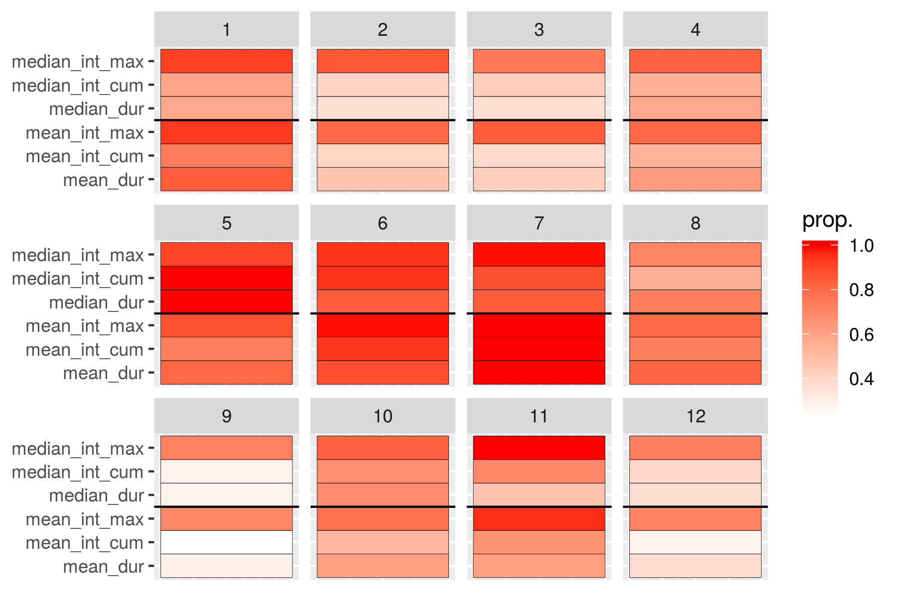
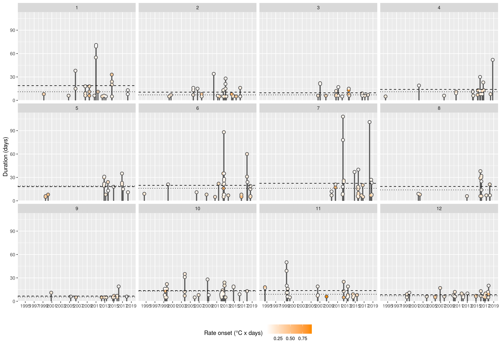

<!--  -->

***

# What are marine heatwaves? 

<!-- ## Definition -->

"A prolonged discrete anomalously warm water event that can be described by its duration, intensity, rate of evolution, and spatial extent."   
  
[@Hobday2016]

 

{ width=90% }  
(_Eric Oliver, www.marineheatwaves.org_)

  
* The temperature at a location exceeds the 90% percentile of that calendar day    
* This occurs at least 5 days in a row with no more than a 2 day gap thereafter    

{ width=100% }  

* One may also download marine heatwave results from the daily updating Marine Heatwave Tracker
    * www.marineheatwaves.org/tracker
    * Contains climatologies, event metrics, and categories

***

# What are known drivers of past MHWs?

* Advection and heat flux are primary drivers of SST
* Different regions of the world show different primary drivers
* For much of the coastal oceans the primary driver is abnormal movement of warm currents onto the coast
* For large seas (i.e. the Mediterranean) warm air plays a more important role

***

# Why use a new method?

* Current standard is to analyse the drivers of one large event at a time
* Smaller events may also be important
* Events are happening too rapidly to spend a year working on them one at a time
* Machine learning may be a better choice moving forwards

***

# What data are we using?

- NOAA OISST
  - Sea surface temperature (SST; °C)
- GLORYS
  - Mixed layer depth (MLD; m)
  - Surface ocean currents (U and V; m/s)
  - Mean sea level pressure (MSLP) **not used in SOM**
- ERA 5
  - Surface air temperature (t2m; °C)
  - Net positive downward heat flux (Qnet; W/m2)
    - Sensible/latent heat flux + long/shortwave radiation
  - Surface wind currents (U and V; m/s)

The common grid used is a 0.25 lon/lat resolution and the temporal resolution is daily.

***

# How are we using these data?

## Study area/regions

- The coastline of Atlantic Canada was divided into several regions based on their SST and SSS climatologies [@Richaud2016]

- The region abbreviations are: 
  - `cbs` = Cabot Strait
  - `gm` = Gulf of Maine 
  - `gls` = Gulf of St. Lawrence
  - `ls` = Labrador Shelf **- NO LONGER USED**
  - `mab` = Mid-Atlantic Bight
  - `nfs` = Newfoundland Shelf 
  - `ss` = Scotian Shelf

## Calculating MHWs

- All of the SST pixels within each region were averaged together into one time series
- MHWs were calculated from these six averaged time series
- A total of 289 MHWs were detected
- The distribution of MHWs is left-skewed

## Creating data packets

- The start and end dates of each MHW were used to create a packet of synoptic state information
- These packets contained one mean anomaly value per pixel per variable for the entire study area
  - The variables are: SST, U, V, t2m, U10, V10, MLD, Qnet
- Anomalies were calculated by subtracting the daily climatology per pixel per variable from the base daily values
- Climatologies were calculated using the @Hobday2016 methodology

## Self-organising map

* Are there recurrent environmental patterns during marine heatwaves?
* If so, can these be detected/quantified by a computer?
* Data packets of synoptic state anomalies fed to SOM to produce 12 most common states
* The occurrence of these states with sub-regions and/or seasons quantified

***

# What are the primary drivers? {.tabset}

## Schematic overview

## SST + U + V (real)

## SST + U + V (anom)

## Air + U + V + MSLP (real)

## Air + U + V + MSLP (anom)

## Qnet + MLD (anom)

## Summary stats heatmap

## Max intensity + region

## Cumulative intensity + season

## Duration

***

# Conclusions

- The SOM technique functions better in the Northwest Atlantic if the Labrador Sea is excluded from the study area
- The nodes tell three primary stories
  - Warm GS + air pushing up from south along coast
  - Warm air sitting over entire coast
  - Warm air being pushed over the AO from the South/Southeast onto the coast

***

# Future work

* Extend the methodology seen here into the third and fourth dimensions of the data
* Run this same analysis 1, 2, 3, etc. months prior to see how well it works
* Test these drivers (node synoptic states) as predictors for events in different data products
* Rank the drivers by their predictive accuracy
* Create operational prediction data layer for public use/consumption

***

# Acknowledgements

## Funding

  
  

  
## University

  

***

# Questions {.tabset}

## Thank you

{ width=120% }

***

## Calculating marine heatwaves (MHWs) {.tabset}

### Time series

{ width=90% }

* First we start with a normal temperature time series
* Temperature (°C) on the y-axis, date on the x-axis

### Day of year

{ width=90% }

* Then we clump all of the same days of the year (doy) together
* The range of values for each doy are shown here as boxplots

### Climatologies

{ width=90% }

* We smooth these values with an 11-day moving average while finding the:
* mean _seasonal signal_ (blue line) & 90th percentile _threshold_ (red line)
* These both are then smoothed with a 31-day moving average

***

## Machine learning {.tabset}

* Are there recurrent environmental patterns during marine heatwaves?
* If so, can these be detected/quantified by a computer?

### Definition 

{ width=60% }

    
  
"A field of study concerned with the design and development of algorithms and techniques that allow computers to learn."     
(_Wiktionary_)

***

### Stress

{ width=110% }

 

* The computer "learns" by reducing stress

***

### Clustering

 
  
(_courtesy Angé Ackerman_)

 

* After ordinating the data the computer tries to find the most similar clusters for them

***

### Self-organising maps {.tabset}

#### Self-organising cats

 
  
(_courtesy Angé Ackerman_)

 

* With self-organising maps the computer then arranges the clusters

***

## Ordination

{ width=90% }

  
* Note how the daily synoptic states form a smooth ellipsoid
* Then note how scattered the marine heatwave synoptic states are

***

# References
